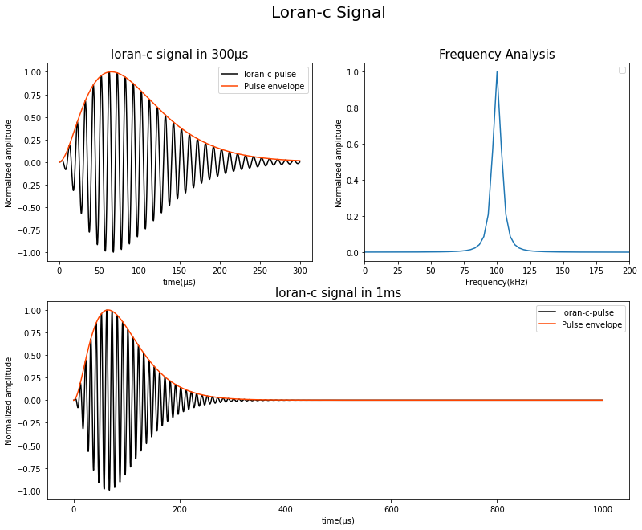
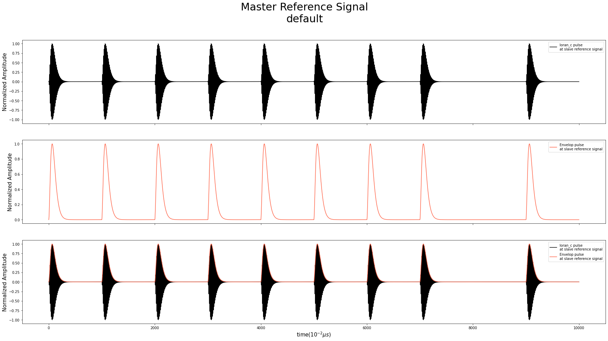
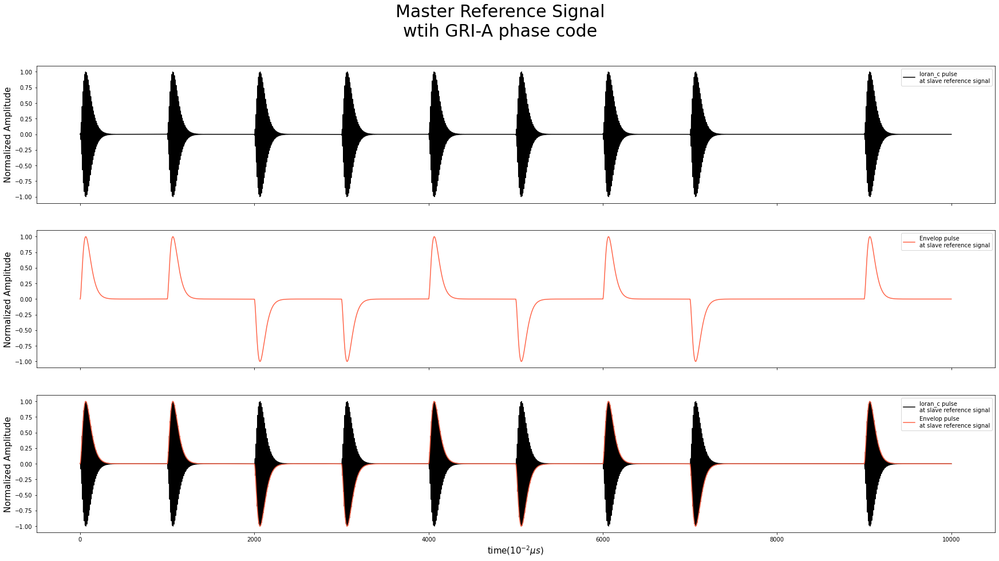
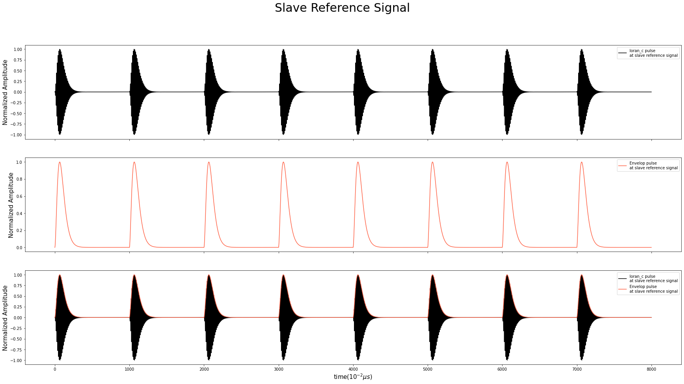
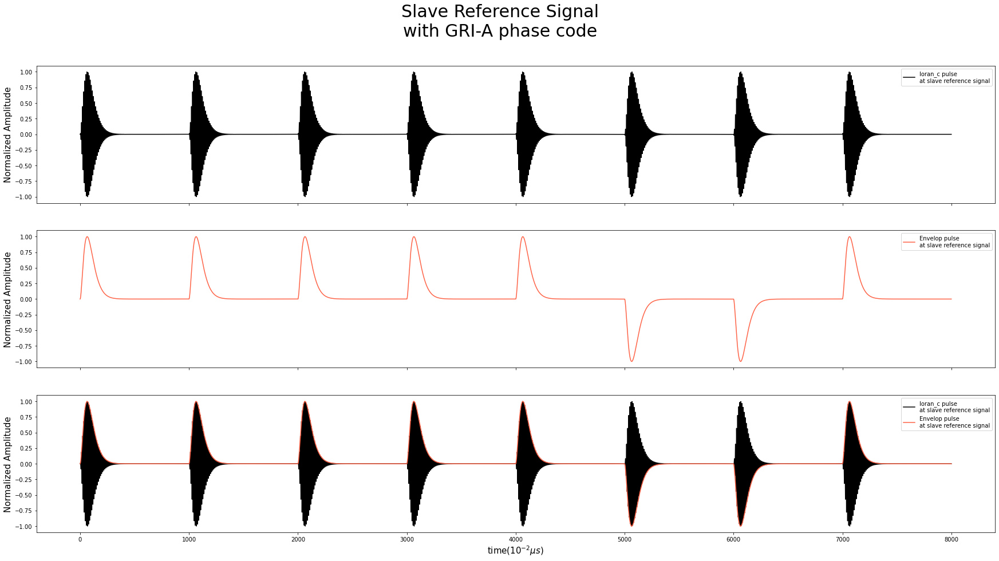
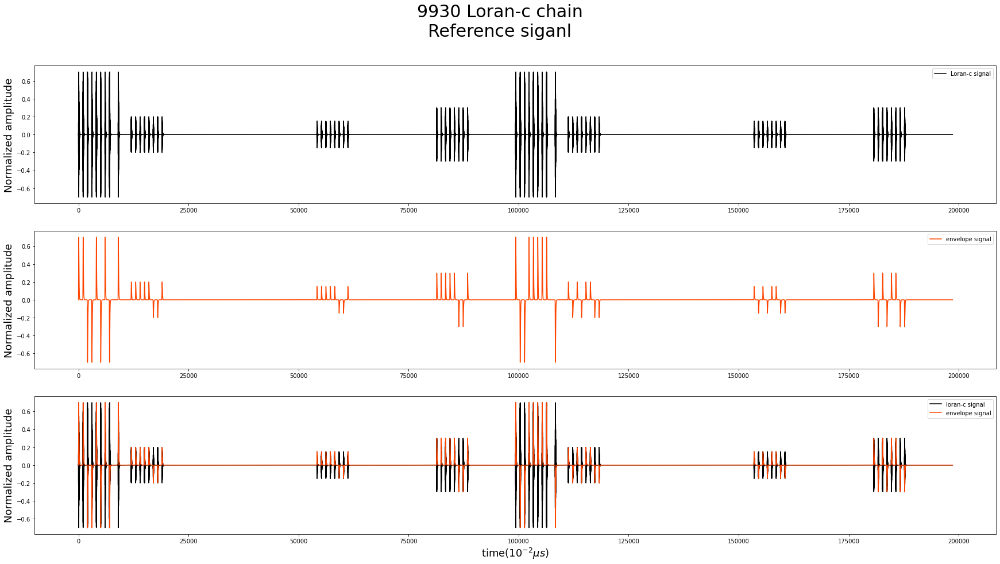
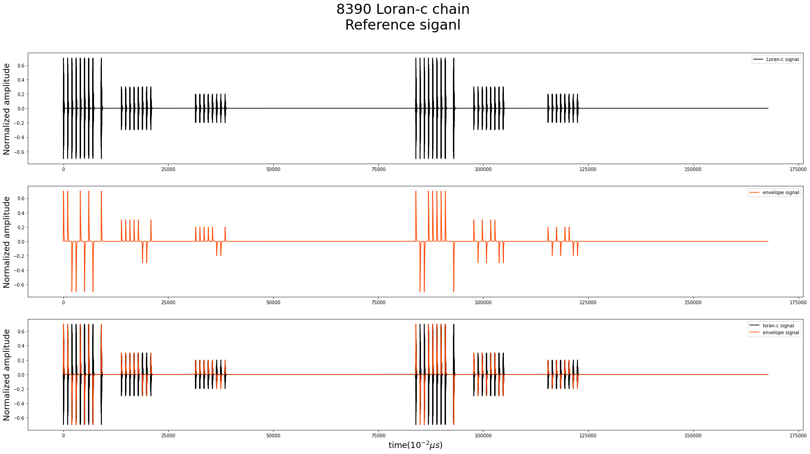
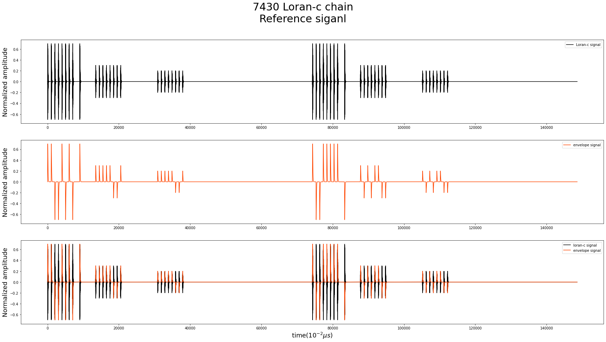

# reference_signal.py

`reference_signal`은 Loran-c signal을 기반으로 하는 Loran-c chain들의 reference 신호들을 생성하는 기능을 가진 API이다. API에 사용된 라이브러리는 `numpy`만이 사용되었다.(`matplotlib`또한 로드 되지만, '데이터 중간 확인용'으로 사용되었고, proto-type 버전 이후 삭제 될 예정) 본 API에서 사용되는 Loran-c는 아래의 그림과 같으며, 이를 활용하여 reference signal을 생성한다. 본 API는 크게 다음의 기능을 가진다.  

<center></center>


## gen_master_signal(phase_code, **kwargs)
---
- Details
    -  **Loran-c chain에서 주국(master station)에서 전송하는 Loran-c reference signal을 생성하는 함수이다.**

    - 각 Loran-c signal은 1ms의 간격으로 총 8개의 신호가 전송되고, 마지막 신호 이후 1ms의 시간을 두고서, Loran-c 신호가 한번 더 전송된다.

    - 본 함수를 통해 생성되는 signal들은 100MHz의 sampling frequency를 갖고 생성된다. (필요에 따라 down-sampling 후 사용 가능)

    - 본 함수에는 `phase_code`, 1개의 keyword argument를 포함한다. 
        - `phase_code` 는 총 9개의 단일 문자로 이루어져있고, 본 문자는 '+', '-', 'dummy'로 이루어져있다.

        - `'+'`, `'-'` 는 master reference signal을 구성하고 있는, Loran-c 신호들의 위상을 결정한다. `'+'` 의 경우, $0$ radian 의 위상을, `'-'` 의 경우 $\pi$ radian 의 위상을 가진다.

        - `'dummy'` 는 코드 내에서 사용되는 인자로 임의로 핸들링 하지 않아도 된다.

        - `phase_code`의 default 값은 ['+', '+', '+', '+', '+', '+', '+', '+', '+', '+']
    
    - `phase_code`는 따로 설정하지 않는다면, default 값으로 적용된다.

    - return 값은 3개로, `timespace`, `master_window`, `master_window_e` 이다.
        - `timespace` : 시간 정보를 저장

        - `master_window` : Loran-c 신호 정보를 저장
        
        - `master_window_e` : Envelope 신호 정보를 저장


- Example; Default
```python
import reference_signal as rs
timespace, master_window, master_window_e = rs.gen_master_signal()
```

- Exmaple; Plot result : Default
<center></center>

- Example; with `phase_code=['+', '+', '-', '-', '+', '-', '+', '-', 'dummy', '+']`
```python
import reference_signal as rs

# GRU-A master phase-code
pc = ['+', '+', '-', '-', '+', '-', '+', '-', 'dummy', '+']

timespace, master_window, master_window_e = rs.gen_master_signal(phase_code=pc)
```

- Example; plot result : with GRI-A Master Phase code
<center></center>


- Plot code(Default)
```python
import matplotlib.pyplot as plt

fig, (loran_c, envelope, together) = plt.subplots(3, 1, figsize=(30,15), sharex=True)
plt.suptitle("Master Reference Signal\ndefault", fontsize=30)

# Loran-c signal at master reference signal
loran_c.plot(timespace, master_window, 'k', label='loran_c pulse\nat slave reference signal')

loran_c.set_ylabel("Normalized Amplitude", fontsize=15)
loran_c.legend(loc='upper right')

# Envelop signal at master reference signal
envelope.plot(timespace, master_window_e, 'tomato', label='Envelop pulse\nat slave reference signal')

envelope.set_ylabel("Normalized Amplitude", fontsize=15)
envelope.legend(loc='upper right')

# Loran-C and Envelop signal at master reference signal
together.plot(timespace, master_window, 'k', label='loran_c pulse\nat slave reference signal')
together.plot(timespace, master_window_e, 'tomato', label='Envelop pulse\nat slave reference signal')

together.set_xlabel("time($10^{-2}\mu s$)", fontsize=15)
together.set_ylabel("Normalized Amplitude", fontsize=15)
together.legend(loc='upper right')

plt.show()
```

## gen_slave_signal(phase_code, **kwargs)
---
- Details
    - **Loran-c chain에서 주국(master station)에서 전송하는 Loran-c reference signal을 생성하는 함수이다.**

    - 각 Loran-c signal은 1ms의 간격으로 총 8개의 신호가 전송된다.

    - 본 함수를 통해 생성되는 signal들은 100MHz의 sampling frequency를 갖고 생성된다. (필요에 따라 down-sampling 후 사용 가능)

    - 본 함수에는 `phase_code`, 1개의 keyword argument를 포함한다. 
        - `phase_code` 는 총 8개의 단일 문자로 이루어져있고, 본 문자는 '+', '-' 로 이루어져있다.

        - `'+'`, `'-'` 는 master reference signal을 구성하고 있는, Loran-c 신호들의 위상을 결정한다. `'+'` 의 경우, $0$ radian 의 위상을, `'-'` 의 경우 $\pi$ radian 의 위상을 가진다.

        - `phase_code`의 default 값은 ['+', '+', '+', '+', '+', '+', '+', '+', '+']
    
    - `phase_code`는 따로 설정하지 않는다면, default 값으로 적용된다.

    - return 값은 3개로, `timespace`, `slave_window`, `slave_window_e` 이다.
        - `timespace` : 시간 정보를 저장

        - `slave_window` : Loran-c 신호 정보를 저장
        
        - `slave_window_e` : Envelope 신호 정보를 저장


- Example; Default
```python
import reference_signal as rs

timespace, slave_window, slave_window_e = rs.gen_master_signal()
```

- Example; plot result : Default
<center></center>


- Example; with `phase_code=['+', '+', '+', '+', '+', '-', '-', '+']`
```python
import reference_signal as rs

# GRU-A master phase-code
pc = ['+', '+', '+', '+', '+', '-', '-', '+']

timespace, master_window, master_window_e = rs.gen_master_signal(phase_code=pc)
```


- Example; plot result : with GRI-A Slave Phase code
<center></center>


- Plot code(Default)
```python
import matplotlib.pyplot as plt

fig, (loran_c, envelope, together) = plt.subplots(3, 1, figsize=(30,15))

# Loran-c signal at slave reference signal
loran_c.plot(timespace, loran_c, 'k', label='loran_c pulse\nat slave reference signal')

# Envelop signal at slave reference signal
envelop.plot(timespace, envelope, 'tomato', label='Envelop pulse\nat slave reference signal')

# Loran-C and Envelop signal at slave reference signal
together.plot(timespace, loran_c, 'k', label='loran_c pulse\nat slave reference signal')
together.plot(timespace, envelope, 'tomato', label='Envelop pulse\nat slave reference signal')

plt.title("Slave Reference Signal")
plt.ylabel("Normalized Amplitude")
plt.xlabel("time($10^{-2}\mu s$)")
plt.legend(loc='upper right')
plt.show()
```


## gen_ref_window_by_id(id, amp_ratio)
---
- Details
    - **Loran-c chain 의 reference signal을 생성하는 함수이다.**

    - 본 함수에서 구현된 Loran-c chain은 아래와 같다.
        - 7430 China North Sea Chain
            - Master : Roncheng

            - Xray : Xuancheng / Emission-Delay : 13,459.7

            - Yankee : Helong / Emission-Delay : 30,852.32

        - 8390 China East Sea Chain
            - Master : Xuancheng

            - Xray : Raoping / Emission-Delay : 13,795.52

            - Yankee : Roncheng / Emission-Delay : 31,459.70

        - 9930 East Asia Chain
            - Mater : Pohang

            - Whiskey : Kwang Ju / Emission Delay : 11,946.97

            - Zulu : Ussuriisk / Emission Delay : 54,162.44

            - Palman : Incheon / Emission Delay : 813452

    - 구현되지 않은 id 입력시 `id error occured`를 출력하며, 구현된 chain만 reference chain 생성이 가능하다.

    - 본 함수로 부터 생성되는 reference signal들은 Phase Code Interval(PCI)에 따른 길이를 가지고 있다.

    - 이때 사용되는 phase_code는 다음과 같다.  
        <center>

        |구분|Master Station|Secondary Station|
        |:-------:|:--------------:|:--------------:|
        |GRI A|+ + - - + - + - +|+ + + + + - - +|
        |GRI B|+ - - + + + + + -|+ - + - + + - -|
        
        </center>

    - 본 함수를 통해 생성되는 reference signal은 100MHz의 sampling-frequency를 가진다.
    
    - 본 함수는 `gen_master_signal()`과 `gen_slave_signal()`을 각각 호출하며, master/slave reference signal을 생성시키고, `emission-delay`에 따라서 master/slave signal을 배치하여 reference signal을 생성한다.

    - 이때의 `emission-delay`는 각 chain별로 저장되어 있는 emission-delay를 사용한다.

    - 대부분의 chain의 전송시에는 물리적 한계로 인해, master와 slave 간 출력 차이가 존재한다. 이를 구현하고자 임의의 amplitude 값을 설정하였다. amplitude값은 사용자에 따라 조정할 수 있다.

    - `gen_ref_window_by_id()`는 `id`, `amp_ratio` 2개의 key argument를 가진다.
        - `id` 는 chain number를 구분한다. 현재(2022.05.11)는 7430, 8390, 9930 chain의 reference signal 생성만 가능하다.

        - `amp_ratio`는 master와 slave 들의 출력 세기를 조절하는 기능을 가지고 있다. 
            - 현재는 임의로 선정한 값(reference들을 참고하여 선정된 값)이 설정되어 있다. 

            - 주국(master station) 과 종국(slave station)의 갯수만큼 `list`형태로 값이 입력되어야 함
                - Example) 주국 1개, 종국 2개 -> 3개의 값 입력

            - 현재 설정되어 있는 amplitude는 다음과 같다.
                - `7430` : amp_ratio = [0.7, 0.3, 0.2]

                - `8390` : amp_ratio = [0.7, 0.3, 0.2]

                - `9930` : amp_ratio = [0.7, 0.2, 0.15, 0.3]

    - `amp_ratio`를 따로 설정하지 않는다면 default값인 0으로 설정되고, 각 chain별 임의로 설정된 값으로 amp_ratio가 설정된다.

    - return 값은 4개로, `timespace`, `signal`, `signal_e`, `id_chain` 이다.
        - `timespace` : 시간 정보를 저장

        - `signal` : Loran-c 신호 정보를 저장
        
        - `signal_e` : Envelope 신호 정보를 저장

        - `id_chain` : Chain의 이름을 저장


- Example; 9930
```python
import reference_signal as rs

timespace, signal, signal_e, id_chain = rs.gen_ref_window_by_id(id=9930)
```
- Example; Plot result : 9930 chain

<center></center>


- Example; 8390
```python
import reference_signal as rs

timespace, signal, signal_e, id_chian = rs.gen_ref_window_by_id(id=8390)
```

- Exmaple; Plot reuslt : 8390 chain
<center></center>


- Example; 7430
```python
import reference_signal as rs

timespace, signal, signal_e, id_chian = rs.gen_ref_window_by_id(id=7430)
```

- Exmaple; Plot reuslt : 7430 chain
<center></center>

- Plot code : 9930 chain
```python
import reference_signal as rs
import matplotlib.pyplot as plt

timespace, signal, signal_e, id_chain = rs.gen_ref_window_by_id(id=9930)

fig, (loran_c, envelope, all_sig) = plt.subplots(3, 1, figsize=(30,15))
plt.suptitle("9930 Loran-c chain\nReference siganl", fontsize=30)

loran_c.plot(timespace, signal, 'k', label="Loran-c signal")
loran_c.legend(loc='upper right')
loran_c.set_ylabel("Normalized amplitude", fontsize=18)

envelope.plot(timespace, signal_e, 'orangered', label="envelope signal")
envelope.legend(loc='upper right')
envelope.set_ylabel("Normalized amplitude", fontsize=18)

all_sig.plot(timespace, signal, 'k', label="loran-c signal")
all_sig.plot(timespace, signal_e, 'orangered', label='envelope signal')
all_sig.set_ylabel("Normalized amplitude", fontsize=18)
all_sig.set_xlabel("time($10^{-2}\mu s$)", fontsize=18)
all_sig.legend(loc='upper right')

plt.show()

```